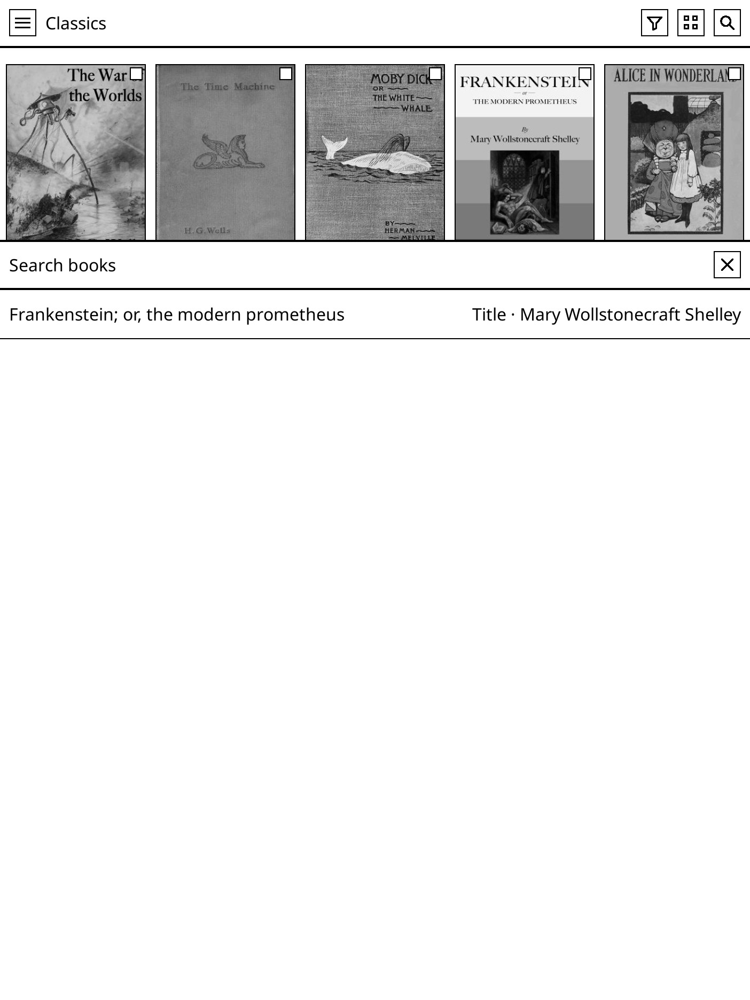
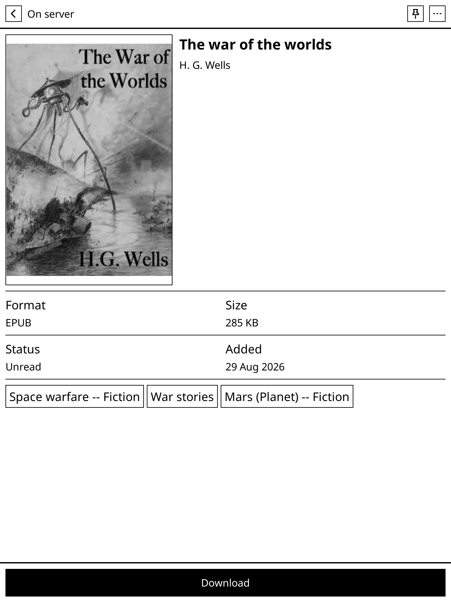

<p align="center">
  
</p>

<p align="center"><strong>Your Grimmory library is the KOReader home screen.</strong></p>

<p align="center">
  <a href="https://github.com/abeant/hansel.koplugin/releases/latest"></a>
  <a href="https://koreader.rocks/"></a>
  <a href="https://grimmory.org/"></a>
  <a href="LICENSE"></a>
</p>

OPDS treats Grimmory as a catalog you visit. Download a book, leave the catalog, hunt for the file in File Manager. Hansel treats Grimmory as the library itself.

Sign in once. Browse every cover. Open a book, download it, or leave it on the server. The reader holds a cache. The collection stays where you already keep it.

<p align="center">
  
  
  
</p>
<p align="center"><sub>Classics library on KOReader. Public-domain covers only.</sub></p>

## Install

1. Download [`hansel.koplugin.zip`](https://github.com/abeant/hansel.koplugin/releases/latest/download/hansel.koplugin.zip) from [Releases](https://github.com/abeant/hansel.koplugin/releases/latest).
2. Unzip it into KOReader's `plugins` folder so you have `plugins/hansel.koplugin/_meta.lua`.
3. Restart KOReader and enable **Hansel** under **Tools → Plugin management** if it is not already on.
4. Open **Tools → Hansel → Show library**, enter your Grimmory URL, username, and password.

To boot into the library, set **File Manager → Settings → Start with → Hansel**. From inside a book, assign **Show Hansel** in Gesture Manager.

Hansel runs anywhere KOReader loads plugins: Android, Kobo, Kindle, PocketBook, reMarkable.

## What it does

- **The cover grid is the library.** Remote books, downloads, and pins share one screen.
- **Your Grimmory structure comes with you.** Libraries, shelves, magic shelves, genres, tags, series, authors, and search.
- **You choose what lives on the device.** Download from a book, pin titles that must stay, jump to **On this device**.
- **Filters and sort stay out of the way.** On-device state, library, shelf, status, format. Sort by title, author, date added, published date, series, rating, size, or last opened.
- **Offline is a mode, not a brick.** Cached covers and catalog pages keep working. **Hide unavailable books** can drop the view to downloads and pins until Grimmory is back.
- **Progress can follow you.** Auto sync is off until you turn it on. It stands down if the official Grimmory plugin is already syncing.
- **Built for e-ink.** Large targets, no animation theater, Comfortable / Compact / Dense grids.

<p align="center">
  
  
</p>

## How it compares

| | [Grimmory plugin](https://github.com/grimmory-tools/grimmory.koplugin) | [KOReader OPDS](https://github.com/koreader/koreader/wiki/OPDS-support) | **Hansel** |
|---|---|---|---|
| Job | Sync books, shelves, and progress into KOReader | Browse any OPDS catalog | **Make Grimmory the KOReader library** |
| Home screen | File Manager or KOReader's library | Catalog, then File Manager | **Your covers** |
| Seeing the collection | What you chose to sync | One feed at a time | **The whole server, on demand** |
| Keeping a book | Sync rules | Download, then find the file | **Download or pin from the book** |
| Offline | Synced copies | Whatever you already downloaded | **Cached catalog, optional on-device-only view** |

Hansel is not trying to replace the official Grimmory plugin or OPDS. Use those when sync or generic catalogs are the point. Use Hansel when the library should be the first thing the device shows.

## Compatibility

| Item | Detail |
|---|---|
| KOReader | 2024.12 or newer |
| Server | A reachable [Grimmory](https://grimmory.org/) instance |
| Devices | Any device that runs KOReader plugins |
| Language | Lua 5.1 / LuaJIT |
| Licence | [AGPL-3.0](LICENSE) |

Hansel is an independent project. It is not affiliated with or endorsed by Grimmory.

## Questions

**Do I have to store the whole library on the reader?**
No. Browse everything. Download what you want. Pin what must not be evicted.

**What if Grimmory is down?**
Hansel keeps the last catalog it saw. With **Hide unavailable books** on, the grid shows downloads and pins until the server returns.

**Will it fight the official Grimmory plugin?**
No. If that plugin is already handling progress sync, Hansel leaves it alone.

**Can I still use File Manager?**
Yes. Close Hansel, or do not set it as **Start with**.

**Does it work without an account?**
You need a Grimmory URL and login. There is no Hansel cloud and no extra account.

## Screens

<p align="center">
  
  
  
</p>
<p align="center">
  
</p>

## Build from source

No Grimmory server is required for tests:

```sh
./tests/run.sh
luacheck --no-self _meta.lua main.lua lib ui
./scripts/package.sh
```

See [CONTRIBUTING.md](CONTRIBUTING.md), [docs/architecture.md](docs/architecture.md), and [CHANGELOG.md](CHANGELOG.md).

## Licence

Hansel is available under the [GNU Affero General Public License v3.0](LICENSE).

<p align="center"><sub>If Hansel makes your Grimmory library feel like it belongs on the device, a star helps other people find it.</sub></p>
