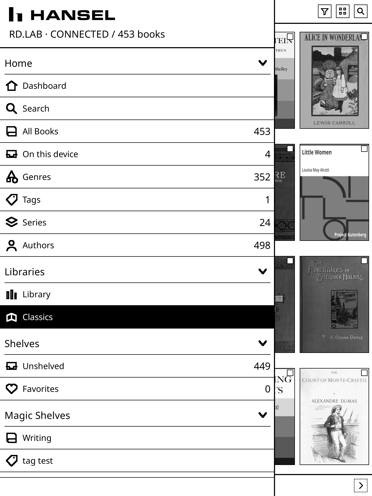
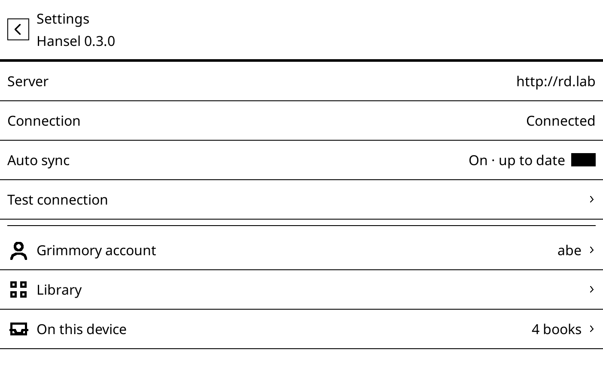
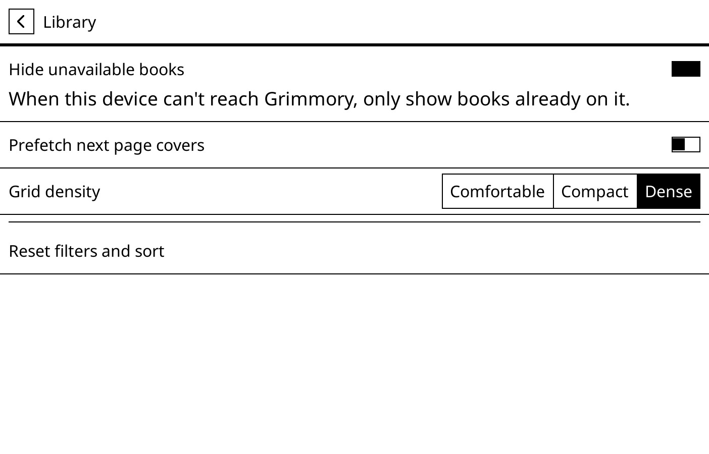
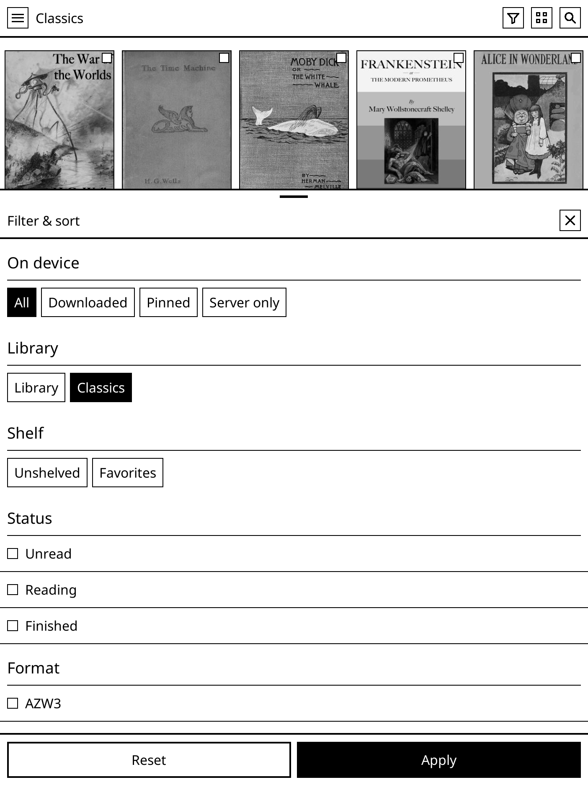
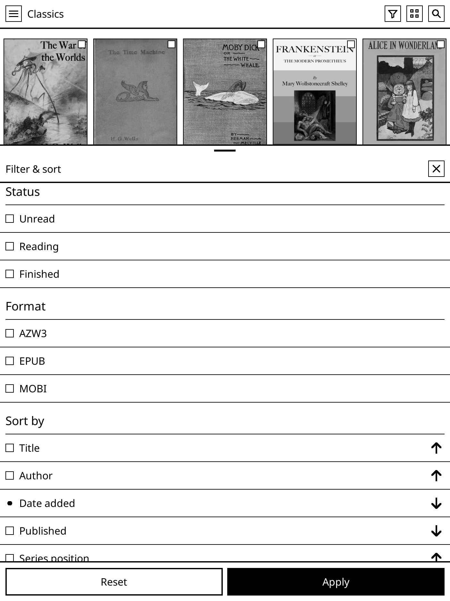

<p align="center">
  
</p>

<p align="center"><strong>Your entire Grimmory library, straight from the home screen.</strong></p>

<p align="center">
  <a href="https://github.com/abeant/hansel.koplugin/actions/workflows/ci.yml"></a>
  <a href="https://github.com/abeant/hansel.koplugin/releases/latest"></a>
  <a href="https://koreader.rocks/"></a>
  <a href="https://grimmory.org/"></a>
  <a href="LICENSE"></a>
</p>

Your books are on the server. Your reading happens on a device across the room. Getting from one to the other usually means browsing on a laptop, pushing files over USB or a share, and then digging through folders on the reader to find what you just sent it.

Hansel closes that gap. It takes over the KOReader home screen and points it straight at [Grimmory](https://grimmory.org/) — every cover, every shelf, every author, read live off the server the moment you open the device. Tap a cover and the book downloads and opens. Pin the ones that should stay put. Everything else remains on the server, one tap away.

<table align="center">
  <tr>
    <td width="33%"></td>
    <td width="33%"></td>
    <td width="33%"></td>
  </tr>
  <tr>
    <td align="center"><sub><b>The whole collection</b><br>not just what you synced</sub></td>
    <td align="center"><sub><b>Your Grimmory structure</b><br>shelves, genres, series, authors</sub></td>
    <td align="center"><sub><b>Read it or leave it</b><br>the file moves only if you say so</sub></td>
  </tr>
</table>

## Install

1. Grab [`hansel.koplugin.zip`](https://github.com/abeant/hansel.koplugin/releases/latest/download/hansel.koplugin.zip) from [Releases](https://github.com/abeant/hansel.koplugin/releases/latest).
2. Unzip it into KOReader's `plugins` folder, so that `plugins/hansel.koplugin/_meta.lua` exists.
3. Restart KOReader. Enable **Hansel** under **Tools → Plugin management** if it isn't already on.
4. Open **Tools → Hansel → Show library** and enter your Grimmory URL, username, and password.

Then make it the front door: **File Manager → Settings → Start with → Hansel**. To jump back from inside a book, bind **Show Hansel** in Gesture Manager.

<table align="center">
  <tr>
    <td width="50%"></td>
    <td width="50%"></td>
  </tr>
  <tr>
    <td align="center"><sub>One server, one login, no Hansel account.</sub></td>
    <td align="center"><sub>Offline behaviour and grid density are yours to set.</sub></td>
  </tr>
</table>

## What it does

- **One grid holds everything.** Books on the server, books you've downloaded, and books you've pinned all sit in the same cover grid. There's no separate downloads screen to go check.
- **Your shelves come along.** Libraries, shelves, magic shelves, genres, tags, series, and authors are read from Grimmory and ordered the way you ordered them there.
- **Long-press a cover to decide.** Read, Download, Pin so it survives cleanup, or Remove from device. Removing touches the local copy only — the server's record is never modified.
- **Narrow it down without leaving the grid.** Filter by on-device state, library, shelf, status, or format. Sort by title, author, date added, published date, series position, rating, size, or last opened.
- **It still works when the server doesn't.** Covers and catalog pages are cached, so the grid paints while you're offline. Switch on **Hide unavailable books** and it narrows to what's genuinely on the device until Grimmory answers again.
- **Progress sync is opt-in.** It's off until you turn it on, and it stands down completely if the official Grimmory plugin is already syncing — the two won't fight over your page position.
- **Built for e-ink.** Large tap targets, no animation, and three grid densities depending on how much screen you have.

<table align="center">
  <tr>
    <td width="33%"></td>
    <td width="33%"></td>
    <td width="33%"></td>
  </tr>
  <tr>
    <td align="center"><sub>Search books, authors, tags, genres</sub></td>
    <td align="center"><sub>Filter down to what's on the device</sub></td>
    <td align="center"><sub>Sort eight ways, either direction</sub></td>
  </tr>
</table>

## How it compares

Hansel isn't trying to replace either of these. They answer different questions.

| | [Grimmory plugin](https://github.com/grimmory-tools/grimmory.koplugin) | [KOReader OPDS](https://github.com/koreader/koreader/wiki/OPDS-support) | **Hansel** |
|---|---|---|---|
| The job | Sync books, shelves, and progress into KOReader | Browse any OPDS catalog | **Make the library the home screen** |
| Home screen | File Manager or KOReader's library | Catalog, then File Manager | **Your covers** |
| What you can see | Whatever you chose to sync | One feed at a time | **The entire server, on demand** |
| Keeping a book | Governed by sync rules | Download, then go find the file | **Download or pin from the book itself** |
| Offline | Your synced copies | Whatever happens to be downloaded | **Cached catalog, plus an on-device-only view** |

Reach for the official plugin when you want real two-way sync. Reach for OPDS when the catalog isn't Grimmory. Reach for Hansel when you want the library to be the first thing the device shows you.

## Compatibility

| | |
|---|---|
| KOReader | 2024.12 or newer |
| Server | A reachable [Grimmory](https://grimmory.org/) instance |
| Devices | Android, Kobo, Kindle, PocketBook, reMarkable — anywhere KOReader loads plugins |
| Language | Lua 5.1 / LuaJIT |
| Licence | [AGPL-3.0](LICENSE) |

Hansel is an independent project. It is not affiliated with or endorsed by Grimmory.

## Questions

**Do I have to keep the whole library on the reader?**
No — that's the point. Browse all of it, download what you're reading, pin what must not be cleaned up.

**What happens when Grimmory is down?**
Hansel paints from the last catalog it cached. With **Hide unavailable books** on, the grid falls back to your downloads and pins until the server comes back.

**Will it fight the official Grimmory plugin?**
No. If that plugin is handling progress sync, Hansel detects it and leaves sync alone.

**Can I still use File Manager?**
Yes. Close Hansel, or just don't set it as **Start with**.

**Does this need an account somewhere?**
Only the Grimmory login you already have. There's no Hansel service and no second account.

**Why "Hansel"?**
Breadcrumbs. Wander as deep into the collection as you like — the trail back to the library is always on screen.

## Build from source

No Grimmory server is needed to run the tests:

```sh
./tests/run.sh
luacheck --no-self _meta.lua main.lua lib ui
./scripts/package.sh
```

Details in [CONTRIBUTING.md](CONTRIBUTING.md), [docs/architecture.md](docs/architecture.md), and [CHANGELOG.md](CHANGELOG.md).

## Licence

[GNU Affero General Public License v3.0](LICENSE).

<p align="center"><sub>If Hansel earns a spot on your reader, a star helps other people find it.</sub></p>
